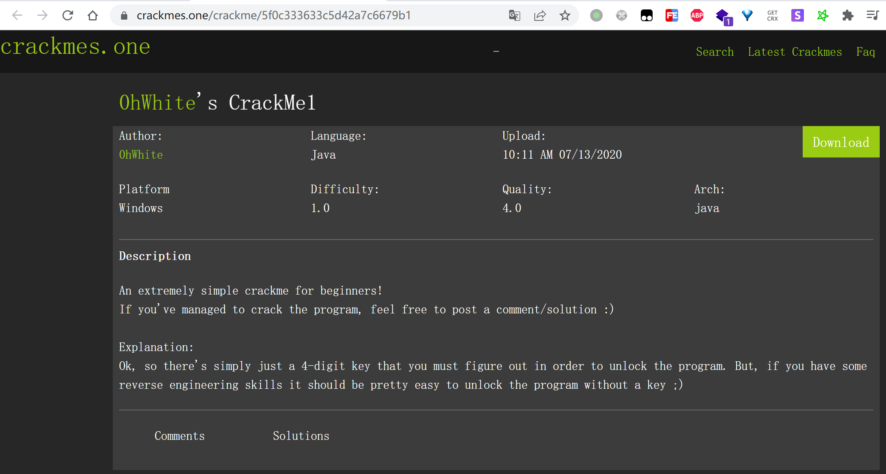
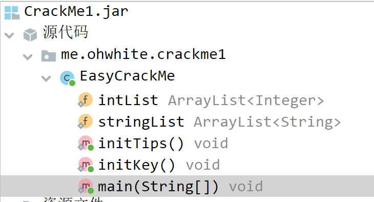
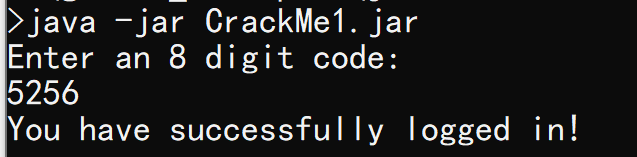

# CrackMe1

题目链接：

```text
https://crackmes.one/crackme/5f0c333633c5d42a7c6679b1
```



下载下来的zip包解压密码：

```text
crackmes.one
```

难度较低，使用jadx打开下载的jar包：



借助于重命名变量功能（选中变量按n）， 将混淆后的代码手动还原提高可读性：

```java
package me.ohwhite.crackme1;

import java.util.ArrayList;
import java.util.Scanner;

/* renamed from: me.ohwhite.crackme1.eahUaRpTUmfhN */
/* loaded from: CrackMe1.jar:me/ohwhite/crackme1/eahUaRpTUmfhN.class */
public class EasyCrackMe {

	/* renamed from: jOloNtfoGORHw */
	static ArrayList<Integer> intList = new ArrayList<>();

	/* renamed from: ALLCxOoknIHmZ */
	static ArrayList<String> stringList = new ArrayList<>();

	public static void main(String[] SqbnompFlDpDc) {
		initTips();
		initKey();
		System.out.println(stringList.get(0));
		Scanner scanner = new Scanner(System.in);
		try {
			int key = scanner.nextInt();
			if (key != intList.get(0).intValue()) {
				return;
			}
		} catch (Exception e) {
			System.exit(-7);
		}
		System.out.println(stringList.get(1));
	}

	/* renamed from: bzoLCpGWzMFbU */
	public static void initKey() {
		intList.add(5256);
	}

	/* renamed from: CEQfFrKZdrnMK */
	public static void initTips() {
		stringList.add("Enter an 8 digit code: ");
		stringList.add("You have successfully logged in!");
	}
}
```

可以看到key很明显就是`5256`，试一下：




