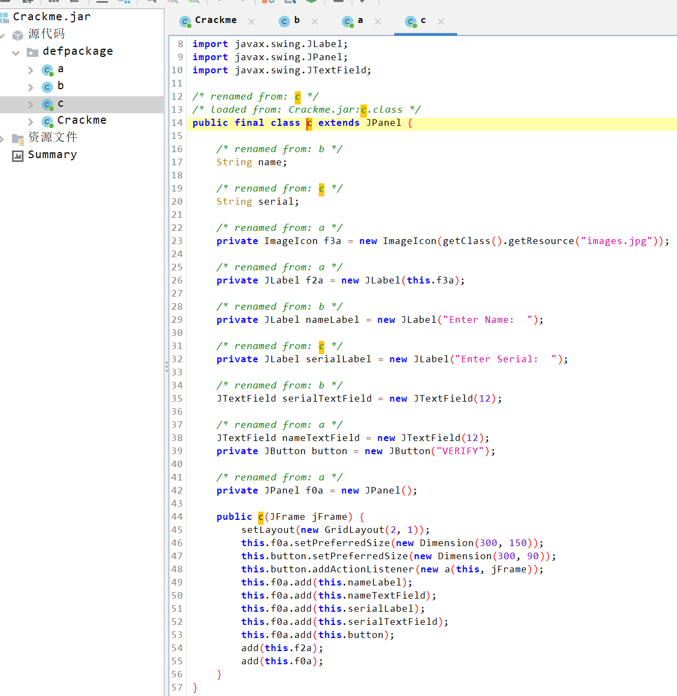
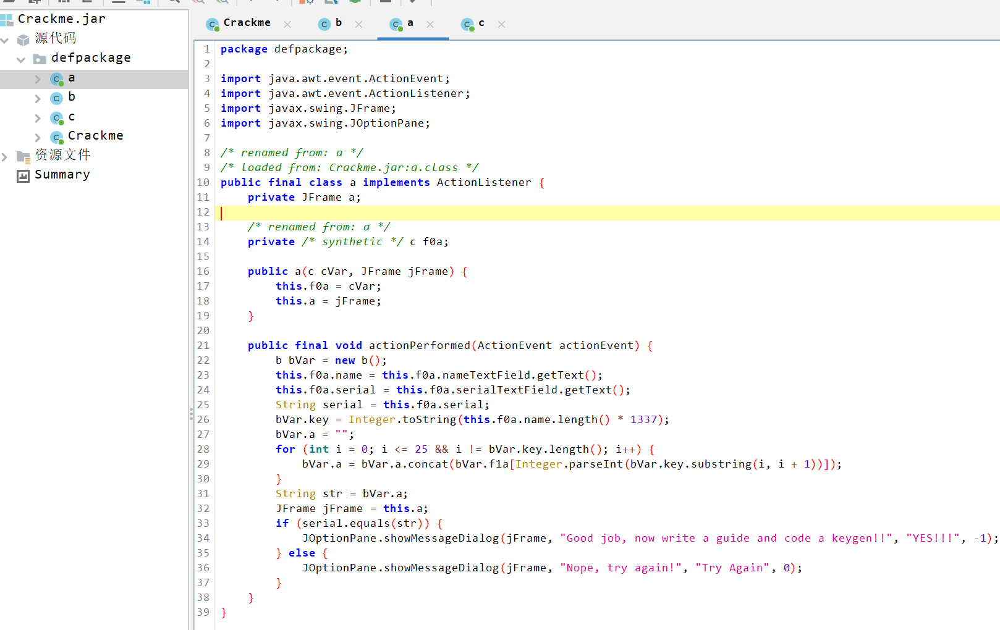
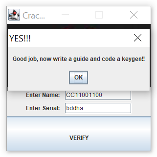

变量名是被混淆的，为了增加可读性，对被混淆的变量名重命名 


重命名变量： 




监听器的逻辑：




抠出来，搞个注册机： 

```java
package cc11001100.crackmes.one.genme_by_cry971c_keygen;

public class KeyGen {

    /**
     * 注册机，从名字生成序列号
     *
     * @param name 要注册的名字
     * @return 此名字对应的序列号
     */
    public static String gen(String name) {
        b bVar = new b();
//        this.f0a.name = this.f0a.nameTextField.getText();
//        this.f0a.serial = this.f0a.serialTextField.getText();
//        String serial = this.f0a.serial;
//        bVar.key = Integer.toString(this.f0a.name.length() * 1337);
        bVar.key = Integer.toString(name.length() * 1337);
        bVar.a = "";
        for (int i = 0; i <= 25 && i != bVar.key.length(); i++) {
            bVar.a = bVar.a.concat(bVar.f1a[Integer.parseInt(bVar.key.substring(i, i + 1))]);
        }
        return bVar.a;
    }

    public static void main(String[] args) {
        String name = "CC11001100";
        System.out.println(gen(name));
        // Output:
        // bddha
    }

}
```


注册成功： 




